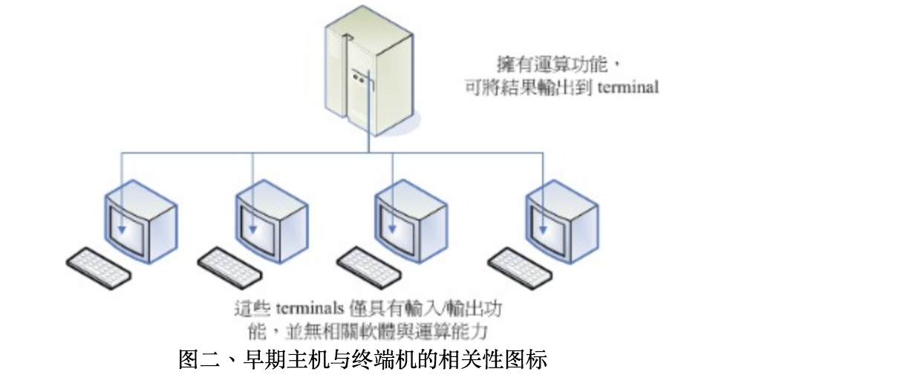

# 序
分享这篇文章的目的是以一个故事的形式, 告诉大家, 一个小的Idea和行动逐步积累可以改变世界.  

关于操作系统的重要性和发展, 可能很多非计算机专业的同学不太了解, 我这里简单的说一下: 改变世界的苹果设备搭载的 MacOS 和 IOS 和非常流行的 Andorid 都是本文提到的操作系统 Unix 的后代. 而其中 GNU 的诞生对于催生 MacOS 和 Android 有着至关重要的作用, 没有 GNU, 也许我们用不到今天的智能手机.  

免费, 开源, 分享, 利他主义曾经改变了世界.  
今天这种精神依然在和商业与专利纠缠不休, 相爱相杀.  

GNU的诞生来源于 Richard Mathew Stallman 的一个小小的Idea, 以及坚持不懈的努力. 让我们一起看看GNU的诞生, 相信你我都会从中受到启发.   

本文以下部分转载自《鸟哥的Linux私房菜》.  

# Linux的诞生
早在 Linux 出现之前的二十年 ( 大约在 1970 年代 )， 就有一个相当稳定而成熟的操作系统存在了！那就是 Linux 的老大哥『 Unix 』是也！ 怎么这么说呢？！他们这两个家伙有什么关系呀？这里就给他说一说啰！众所皆知的， Linux 的核心是由 Linus Torvalds 在 1991 年的时候给他开发出来的， 并且丢到网络上提供大家下载，后来大家觉得这个小东西 ( Linux Kernel ) 相当的小而精巧，所以慢慢的就有相当多的朋友投入这个小东西的研究领域里面去了！ 但是为什么这的小东西这么棒呢？！然而又为什么大家都可以免费的下载这个东西呢？！ 嗯！等鸟哥慢慢的唬xx....喔不！听我慢慢的道来！

## 1969 年以前：一个没有完成的梦想： Bell, MIT 与 GE 的『 Multics』系统

早期的计算机并不像现在的个人计算机一样，他可不是一般人碰的起的呢～ 除非是军事或者是高科技用途，或者是学术单位的学术研究，否则，真的很难接触到。 非但如此，早期的计算机架构还很难使用，除了指令周期并不快之外，操作接口也很困扰的！ 在那个时候，写程序是件很可怜的事情，因为，程序设计者，必须要将程序相关的信息在读卡纸上面打洞， 然后再将读卡纸插入卡片阅读机来将信息读入主机中运算。光是这样就很麻烦了，如果程序有个小地方写错， 哈哈！光是重新打卡就很惨，加上主机少，用户众多，光是等待，就耗去很多的时间了！

在之后，经由操作系统的改良，使得后来可以使用键盘来进行信息的输入/输出。 不过，在一间学校里面，主机毕竟可能只有一部，如果多人等待使用，那怎么办？ 好在 1960 年代初期麻省理工学院 (MIT) 发展了所谓的： 『兼容分时系统( Compatible Time-Sharing System, CTSS )』， 它可以让大型主机透过提供数个终端机(terminal)以联机进入主机，来利用主机的资源进行运算工作。 架构有点像这样：

如此一来，无论主机在哪里，只要在终端机前面进行输入输出的作业，就可利用主机提供的功能了。 不过，需要注意的是，此时终端机只具有输入/输出的功能，本身完全不具任何运算或者软件安装的能力。 而且，比较先进的主机大概也只能提供 30 个不到的终端机而已。

为了更加强化大型主机的系统，以让主机的资源可以提供更多使用者来利用，所以在 1965 年前后， 由贝尔实验室 (Bell)、麻省理工学院 (MIT) 及奇异公司 (GE) 共同发起了 Multics 的计划， Multics 目的是想要让大型主机可以达成提供 300 个以上的终端机联机使用的目标。 不过，到了 1969 年前后，计划进度落后，资金也短缺，所以该计划就宣告不治.....喔！是宣告失败～ (注： Multics 有复杂、多数的意思存在。)

## 1969 年： Ken Thompson 的小型 file server system
在认为 Multics 计划不可能成功之后，贝尔研究室 就退出该计划。不过，原本参与 Multics 计划的人员中，已经从该计划当中获得一些点子， Ken Thompson 就是其中一位！Thompson 因为自己的需要，希望开发一个小小的操作系统， 以提供自己的需求。在开发时，有一部 DEC (Digital Equipment Corporation) 的 PDP-7 没人使用， 于是他就准备针对这部主机进行操作系统核心程序的撰写。本来 Thompson 是没时间的， 有趣的是，在 1969 年八月份左右，刚好 Thompson 的妻儿去了美西探亲， 于是他有了额外的一个月的时间好好的待在家将一些构想实现出来！ 经过四个星期的奋斗，他终于以组译语言 (Assembler) 写出了一个核心程序，同时包括一些核心工具程序， 以及一个小小的文件系统。那个系统就是 Unix 的原型！ 当时 Thompson 将 Multics 庞大的复杂系统简化了不少，于是同实验室的朋友都戏称这个系统为： Unics 。 Thompson 的这个文件系统有两个重要的概念，分别是：

- 所有的程序或系统装置都是档案
- 不管建构编辑器还是附属档案，所写的程序只有一个目的，且要有效的完成目标。

## 1973 年： Unix 的正式诞生，Ritchie 等人以 C 语言写出第一个正式 Unix 核心
由于 Thompson 写的那个操作系统实在太好用了，所以在贝尔实验室内部广为流传，并且数度经过改版。 但是，比较重要的改版则发生在 1973 年。Unix 本来是以组译语言写成的，后来因为系统移植与效能的需求， 该系统被 B 语言所改写。不过，效能依旧不是很好。后来， Dennis Ritchie 将 B 语言重新改写成 C 语言，C 语言算是比较高阶的程序语言，可以在不同的机器上面运作， 而 Ritchie 等人也同时将原本 Thompson 的那个操作系统重新以 C 语言改写， 最后发行出 Unix 的正式版本！

在这个时候需要特别注意的是，贝尔实验室是隶属于 AT&T 的，只是 AT&T 当时忙于其他商业活动， 所以对于 Unix 是采取比较开放的态度，此外， Unix 在这个时期的发展者都是贝尔实验室的工程师， 这些工程师对于程序当然相当有研究，所以， Unix 在此时当然是不容易被一般人所接受的！ 此外，也需要特别强调，由于 Unix 是以较高阶的 C 语言写的，相对于组译语言需要与硬件有密切的配合， 高阶的 C 语言与硬件的相关性就没有这么大了！所以，这个改变也使得 Unix 很容易被移植到不同的机器上面喔！
1977 年： 重要的 Unix 分支： BSD 的诞生
前面说到，虽然贝尔属于 AT&T ，但是 AT&T 此时对于 Unix 是采取开放的态度， 此外， Unix 是以高阶的 C 语言写成的，理论上是具有可移植性的！ 所以，只要取得 Unix 的原始码，并且针对大型主机的特性加以修订原有的原始码( Source Code )， 就可能将 Unix 移植到另一部不同的主机上头了。所以在 1973 年以后， Unix 便得以与学术界合作开发！最重要的接触就是与加州柏克莱 ( Berkeley ) 大学的合作了。 柏克莱大学的 Bill Joy 在取得了 Unix 的核心原始码后，着手修改成适合自己机器的版本， 并且同时增加了很多工具软件与编译程序，最终将他命名为 Berkeley Software Distribution (BSD) 。这个 BSD 是 Unix 很重要的一个分支， Bill Joy 也是 Unix 业者『 Sun 』这家公司的创办者！ Sun 公司即是以 BSD 发展的核心进行自己的商业 Unix 版本的发展的。 (后来可以安装在 x86 硬件架构上面 FreeBSD 即是 BSD 改版而来！)

## 1979 年： 一个措手不及的版权宣告！
由于 Unix 的高度可移植性与强大的效能，加上当时并没有版权的纠纷， 所以让很多商业公司开始了 Unix 操作系统的发展，例如 AT&T 自家的 System V、IBM 的 AIX 以及 HP 与 DEC 等公司，都有推出自家的主机搭配自己的 Unix 操作系统。

但是，如同我们前面提到的，操作系统的核心 ( Kernel ) 必须要跟硬件配合， 以提供及控制硬件的资源进行良好的工作！ 而在早期每一家生产计算机硬件的公司还没有所谓的『协议』的概念， 所以每一个计算机公司出产的硬件自然就不相同啰！因此他们必须要为自己的计算机硬件开发合适的 Unix 系统。 例如在学术机构相当有名的 Sun 、 Cray 与 HP 就是这一种情况。 他们开发出来的 Unix 操作系统以及内含的相关软件并没有办法在其他的硬件架构下工作的！ 且由于没有厂商针对个人计算机设计 Unix 系统，因此，在早期并没有支持个人计算机的 Unix 操作系统的出现 ( 由于 Unix 强调的是多人多任务的环境，但早期的 x86 个人计算机架构下的 CPU 是没有能力达到多任务的作业，因此，并没有人对移植 Unix 到 x86 的计算机上有兴趣 )。 每一家公司自己出的 Unix 虽然在架构上面大同小异，但是却真的仅能支持自身的硬件， 所以啰，早先的 Unix 只能与服务器 ( Server ) 或者是大型工作站 ( Workstation ) 划上等号！

但是这个高度开放的 Unix 系统在 1979 年有了重大的转折～ 因为 AT&T 由于商业的考虑，以及在当时现实环境下的思考，于是将想 Unix 的版权收回去， 因此，在 AT&T 在 1979 年发行的第七版 Unix 中，特别提到了 『不可对学生提供原始码』的严格限制！ 同时，也造成 Unix 业界之间的紧张气氛，并且也引爆了很多的商业纠纷～
## 1984 年之一： x86 架构的 Minix 诞生
关于 1979 年的版权声明中，影响最大的当然就是学校教 Unix 相关学问的教授了！ 想一想，如果没有核心原始码，那么如何教导学生认识 Unix 呢？ 这问题对于 Andrew Tanenbaum (谭宁邦)教授来说，实在是很伤脑筋的！ 不过，学校的课程还是得继续啊！那怎么办？？ 既然 1979 年的 Unix 第七版可以在 Intel 的 x86 架构上面进行移植， 那么是否意味着可以将 Unix 改写并移植到 x86 上面了呢？在这个想法上， 谭宁邦教授于是乎自己动手写了 Minix 这个 Unix Like 的核心程序！ 在撰写的过程中，为了避免版权纠纷，谭宁邦完全不看 Unix 核心原始码！ 并且强调他的 Minix 必须能够与 Unix 兼容才行！谭宁邦在 1984 年开始撰写核心程序， 到了 1986 年终于完成，并于次年出版 Minix 相关书籍，同时与新闻组相结合～

这个 Minix 版本比较有趣的地方是，他并不是完全免费的，无法在网络上提供下载！ 必须要透过磁盘/磁带购买才行！虽然真的很便宜～不过，毕竟因为没有在网络上流传， 所以 Minix 的传递速度并没有很快速！此外，购买时，随磁盘还会附上 Minix 的原始码！ 这意味着使用者可以学习 Minix 的核心程序设计概念喔！ (这个特色对于 Linux 的启始开发阶段，可是有很大的关系喔！) 此外，开发者仅有谭宁邦教授，因为学者很忙啊！加上谭宁邦始终认为 Minix 主要用在教育用途上面， 所以对于 Minix 是点到为止！所以， Minix 很受欢迎没错， 不过，使用者的要求/需求的声音可能就比较没有办法上升到比较高的地方了！ 这样说，您明白吧？？？ ^_^
## 1984 年之二： GNU 与 FSF 计划的成立
Richard Mathew Stallman (史托曼) 在 1984 年发起的 GNU 计划，对于现今的自由软件风潮， 真有不可磨灭的地位！目前我们所使用得很多自由软件，几乎均直接或间接帮助于 GNU 这个计划呢！ 那么史托曼是何许人也？为何他会发起这个 GNU 计划呢？

Richard Mathew Stallman (生于 1953 年， 网络上自称的 ID 为 RMS) 从小就很聪明！他在 1971 年的时候，进入黑客圈中相当出名的人工智能实验室(AI Lab.)， 这个时候的黑客专指计算机功力很强的人，而非破坏计算机的怪客 (cracker) 喔！ 当时的黑客圈对于软件的着眼点几乎都是在『分享』，所以并没有专利方面的困扰！ 这个特色对于史托曼的影响很大！不过，后来由于管理阶层的问题，导致实验室的优秀黑客离开该实验室， 并且进入其他商业公司继续发展优秀的软件。但史托曼并不服输，仍然持续在原来的实验室开发新的程序与软件。 后来，他发现到，自己一个人并无法完成所有的工作，于是想要成立一个开放的团体来共同努力！

1983 年以后，因为实验室硬件的更换，使得史托曼无法继续以原有的硬件与操作系统继续自由程序的撰写～ 而且他进一步发现到，过去他所使用的 Lisp 操作系统，是麻省理工学院的专利软件， 是无法共享的，这对于想要成立一个开放团体的史托曼是个阻碍。于是他便放弃了 Lisp 这个系统。 后来，他接触到 Unix 这个系统，并且发现， Unix 在理论与实际上，都可以在不同的机器间进行移植。 于是他开始转而使用 Unix 系统。因为 Lisp 与 Unix 是不同的系统， 所以，他原本已经撰写完毕的软件是无法在 Unix 上面运行的！为此， 他就开始将软件移植到 Unix 上面。并且，为了让软件可以在不同的平台上运作， 因此，史托曼将他发展的软件均撰写成可以移植的型态！

1984 年，史托曼开始 GNU 计划，这个计划的目的是想要： 建立一个自由的开放的 Unix 操作系统。 但是建立一个操作系统谈何容易啊！而且在当时的 GNU 是仅有自己一个人单打独斗的史托曼～ 这实在太麻烦，但又不能不做这个计划，于是史托曼反其道而行～『既然操作系统太复杂， 我就先写可以在 Unix 上面运行的小程序，这总可以了吧？呵呵！』在这个想法上， 史托曼便开始了程序的写作。在写作期间，为了不让自己吃上官司，他绝对不看专利软件的原始码！ 为了这个计划，他开始使用原本 Unix 上面跑的软件， 并自行撰写功能与 Unix 原有专利软件相仿的软件。

但不论是什么软件，都得要进行编译成为二进制文件(binary file)后才能够执行， 因此他便开始撰写 C 语言的编译程序，那就是现在相当有名的 GNU C (gcc)！ 这个点相当的重要！这是因为 C 语言编译程序版本众多，但都是专利软件， 如果他写的 C 编译程序够棒，效能够佳，那么将会大大的让 GNU 计划出现在众人眼前！

但开始时并不顺利，为此，他先转而将 Emacs 编辑器写成可以在 Unix 上面跑得软件， 并公开公布原始码，因为 Emacs 太优秀了，因此，很多人便直接向他购买。此时 Internet 尚未流行， 所以，史托曼便借着 Emacs 以磁带(tape)出售，赚了一点钱 ，进而开始全力撰写其他软件。并且成立 自由软件基金会 (FSF, Free Software Foundation)，请更多工程师与志工撰写软件。 终于还是完成了 GCC，这比 Emacs 还更有帮助！ 此外，他还撰写了更多可以被呼叫的 C 函式库(GNU C library)， 以及可以被使用来操作操作系统的基本接口 BASH shell ！ 这些都在 1990 年左右完成了！
> Tips: 如果纯粹使用文本编辑器来编辑程序的话，那么程序语法如果写错时， 只能利用编译时发生的错误讯息来修订了，这样实在很没有效率。 Emacs 则是一个很棒的编辑器！注意！是编辑(editor)而非编译(compiler)！ 他可以很快的立刻显示出您写入的语法可能有错误的地方，这对于程序设计师来说， 实在是一个好到不能再好的工具了！所以才会这么的受到欢迎啊！  

到了 1985 年，为了避免 GNU 所开发的自由软件被其他人所利用而成为专利软件， 所以他与律师草拟了有名的通用公共许可证 (General Public License, GPL)， 并且称呼他为 copyleft (相对于专利软件的 copyright！)。 关于 GPL 的相关内容我们在下一个小节继续谈论，在这里，必须要说明的是， 由于有 GNU 所开发的几个重要软件，如：

- Emacs
- GNU C (GCC)
- GNU C Library (glibc)
- Bash shell

造成后来很多的软件开发者可以藉由这些基础的工具来进行程序开发！ 进一步壮大了自由软件团体！这是很重要的！不过，对于 GNU 的最初构想 『建立一个自由的 Unix 操作系统』来说，有这些优秀的程序是仍无法满足， 因为，当下并没有『自由的 Unix 核心』存在.....所以这些软件仍只能在那些有专利的 Unix 平台上工作～～一直到 Linux 的出现......

## 1991 年： 芬兰大学生 Linus Torvalds 的一则简讯
到了 1991 年，芬兰的赫尔辛基大学的 Linus Torvalds 在 BBS 上面贴了一则消息， 宣称他以 bash, gcc 等工具写了一个小小的核心程序，这个核心程序可以在 Intel 的 386 机器上面运作，让很多人很感兴趣！从此开始了 Linux 不平凡的路程！

# 关于 GNU 计划
1984 年创立 GNU 计划与 FSF 基金会的 Stallman 先生认为， 写程序最大的快乐就是让自己发展的良好的软件让大家来使用了！ 而既然程序是想要分享给大家使用的，不过，每个人所使用的计算机软硬件并不相同， 既然如此的话，那么该程序的原始码 (Source code) 就应该要同时释出， 这样才能方便大家修改而适用于每个人的计算机中呢！这个将原始码释出的举动， 就称为 Open Source ！此外，史托曼同时认为，如果您将您程序的 Source code 分享出来时，若该程序是很优秀的，那么将会有很多人使用， 而每个人对于该程序都可以查阅 source code ，无形之中，就会有一票人帮您除错啰！ 您的这支程序将会越来越壮大！越来越优秀呢！

而为了避免自己的开发出来的 Open source 的自由软件被拿去做成专利软件， 于是 Stallman 同时将 GNU 与 FSF 发展出来的软件，都挂上 GPL 的版权宣告～ 这个 FSF 的核心观念是『版权制度是促进社会进步的手段， 版权本身不是自然权力。』对于 FSF 有兴趣或者对于 GNU 想要更深入的了解时，请参考树德大学的洪朝贵教授的网站 http://saturn.stu.edu.tw/~ckhung/a/c_83.php，或直接到 GNU 去： http://www.gnu.org 里面有更为深入的解说！

>Tips:
为什么要称为 GNU 呢？其实 GNU 是 GNU's Not Unix 的缩写， 意思是说， GNU 并不是 Unix 啊！那么 GNU 又是什么呢？ 就是 GNU's Not Unix 嘛！.....如果您写过程序， 就会知道，这个 GNU = GNU's Not Unix 可是无穷循环啊！忙碌～  
另外，什么是 Open Source 呢？所谓的 source 是程序发展者写出的源代码， Open Source 就是，软件在发布时，同时将作者的原始码一起公布的意思！

那么这个 GPL ( GNU General Public License, GPL ) 是什么玩意儿？ 为什么要将自由软件挂上 GPL 的『版权宣告』呢？这个版权宣告对于作者有何好处？  
首先， Stallman 对 GPL 一直是强调 Free 的，这个 Free 的意思是这样的：

"Free software" is a matter of liberty, not price. To understand the concept, you should think of "free speech", not "free beer". "Free software" refers to the users freedom to run, copy, distribute, study, change, and improve the software 

大意是说， Free Software (自由软件) 是一种自由的权力，并非是『价格！』 举例来说，你可以拥有自由呼吸的权力、你拥有自由发表言论的权力， 但是，这并不代表您可以到处喝『免费的啤酒！(free beer)』，也就是说， 自由软件的重点并不是指『免费』的，而是指具有『自由度, freedom』的软件， 史托曼进一步说明了自由度的意义是： 使用者可以自由的执行、复制、再发行、学习、修改与强化自由软件。 这无疑是个好消息！因为如此一来，你所拿到的软件可能原先只能在 Unix 上面跑， 但是经过原始码的修改之后，你将可以拿他在 Linux 或者是 Windows 上面来跑！总之，一个软件挂上了 GPL 版权宣告之后，他自然就成了自由软件！ 这个软件就具有底下的特色：

- 取得软件与原始码：您可以根据自己的需求来执行这个自由软件；
- 复制：您可以自由的复制该软件；
- 修改：您可以将取得的原始码进行程序修改工作，使之适合您的工作；
- 再发行：您可以将您修改过的程序，再度的自由发行，而不会与原先的撰写者冲突；
- 回馈：您应该将您修改过的程序代码回馈于社群！

但请特别留意，您所修改的任何一个自由软件都不应该也不能这样：
- 修改授权：您不能将一个 GPL 授权的自由软件，在您修改后而将他取消 GPL 授权～
- 单纯贩卖：您不能单纯的贩卖自由软件。

也就是说，既然 GPL 是站在互助互利的角度上去开发的，您自然不应该将大家的成果占为己有， 而取消 GPL 授权的！对吧！因此您当然不可以将一个 GPL 软件的授权取消， 即使您已经对该软件进行大幅度的修改！那么自由软件也不能贩卖吗？当然不是！还记得上一个小节里面， 我们提到史托曼藉由贩卖 Emacs 取得一些经费，让自己生活不至于匮乏吧？？是的！ 自由软件是可以贩卖的，不过，不可仅贩卖该软件，应同时搭配售后服务与相关手册～ 这些可就需要工本费了呢！

很多人还是有疑问，目前不是有很多 Linux 开发商吗？为何他们可以贩卖 Linux 这个 GPL 授权的软件？ 原因很简单，因为他们大多都是贩卖『售后服务！』所以，他们所使用的自由软件， 都可以在他们的网站上面下载！(当然，每个厂商他们自己开发的工具软件就不是 GPL 的授权软件了！) 但是，您可以购买他们的 Linux 光盘，如果您购买了光盘，他们会提供相关的手册说明文件， 同时也会提供您数年不等的咨询、售后服务、软件升级与其他协力工作等等的附加价值！ 所以说，目前自由软件工作者，他们所赖以维生的，几乎都是在『服务』这个领域呢！ 毕竟自由软件并不是每个人都会撰写，有人有需要您的自由软件时，他就会请求您的协助， 此时，您就可以透过服务来收费了！这样来说， 自由软件确实还是具有商业空间的喔！

> Tips:
很多人对于 GPL 授权一直很疑惑，对于 GPL 的商业行为更是无法接受！ 关于这一点，鸟哥在这里还是要再次的申明， GPL 是可以从事商业行为的！ 而很多的作者也是藉由这些商业行为来得以取得生活所需，更进一步去发展更优秀的自由软件！ 千万不要听到『商业』就排斥！这对于发展优良软件的朋友来说，是不礼貌的！	鸟哥的图示

上面提到的大多是与用户有关的项目，那么 GPL 对于自由软件的作者有何优点呢？ 大致的优点有这些：
- 软件安全性较佳；
- 软件执行效能较佳；
- 软件除错时间较短；
- 贡献的原始码远永都存在。 

这是因为既然是 Open Source 的自由软件，那么您的程序代码将会有很多人帮您查阅， 如此一来，程序的漏洞与程序的优化将会进展的很快！所以，在安全性与效能上面， 自由软件一点都不输给商业软件喔！此外，因为 GPL 授权当中，修改者并不能修改授权， 因此，您如果曾经贡献过程序代码，嘿嘿！您将名留青史呢！不错吧！ ^_^

不过，就鸟哥的观点来看， GPL 对于程序开发者的优点是相当多的，不过， 对于不熟悉程序的一般人来说， GPL 的优点其实不太容易看出来～ 首先，虽然他是随手可得的自由软件，不过，您也必须要会使用基本的编译程序才行吧！ (呵呵！这也是您为何要买这本书/察看鸟哥的网站的原因吧！ ^_^) 这对于一般人来说并不容易！当然啦，如果每个人都跟 Stallman 一样神，那商业公司就不用存在啦！ 嘿嘿！对于不懂程序的人来说，商业公司是一个很快速的解决之道啊！ 而对于我们广大的读者群来说，认识了/学习了 Linux 与自由软件的相关技巧后， 对于未来真的是有很不错的帮助喔！
